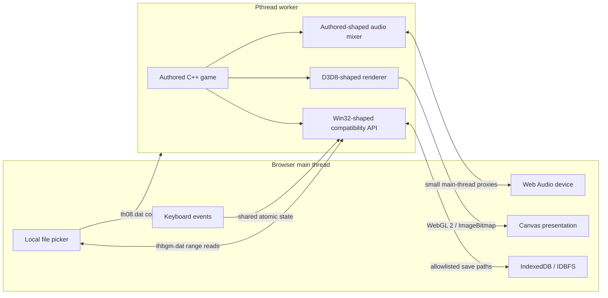

# Engineering TH08 Web

This document explains how TH08 Web was taken from a reconstructed Win32-era
C++ codebase to a public, source-built browser release. It follows the work in
the order that made each unknown independently testable: compile first, define
the browser boundaries, reach a playable frame, remove the temporary hot-path
compatibility code, restore runtime correctness, and only then publish.

For the current system contract and the full verification record, see
[Web port architecture and status](WEB_ARCHITECTURE.md). This document focuses
on the engineering journey and the decisions behind the final design.

## 1. Definition of done

The product goal was deliberately concrete:

> Open a page, select `th08.dat` and `thbgm.dat` from a legal local TH08
> installation, and play Imperishable Night in the browser.

That sentence established five non-negotiable constraints.

| Constraint | Consequence |
| --- | --- |
| Use the reconstructed source | Gameplay remains in C++; JavaScript is only a browser boundary. |
| Do not distribute retail data | DAT files must come from the local file picker and must never enter the deployment artifact. |
| Preserve the existing engine shape | Win32, DirectInput, DirectSound, and D3D8 calls need compatibility surfaces rather than a rewritten game. |
| Keep bullet-hell timing playable | The browser event loop, renderer, and input path must sustain stable authored frame progression. |
| Publish as a normal static site | The result must be HTML, JavaScript, Wasm, and project-owned metadata, with no application server or uploaded game data. |

The Web target is a modern port from the reconstructed sources. It does not
claim that the Wasm output matches the original x86 executable byte-for-byte.
The reconstruction and the browser product share authored C++ behavior but
have different compilers, ABIs, platform code, and distribution artifacts.

## 2. Choosing the architecture

Three broad approaches were possible.

### Rewrite the game for a browser framework

A JavaScript or TypeScript recreation could have produced a Web-native codebase,
but it would create a second gameplay implementation. Every movement rule,
enemy opcode, spell condition, score update, and animation quirk would then
need to be rediscovered and kept in sync.

### Run the original x86 executable in an emulator

An emulator could preserve the retail program, but it would make the original
executable part of the runtime requirement, retain the old graphics and system
boundaries, and move the project away from its source-reconstruction advantage.

### Compile the reconstructed C++ to WebAssembly

Emscripten could compile the existing 32-bit-oriented C++ while providing SDL,
WebGL, Web Audio, pthread, and filesystem integration. The browser-specific work
could stay at the same seams already used by the modern compatibility layer.

This third option was selected. The final ownership boundary is:



The main thread owns browser-only APIs. A pthread worker owns the authored game
loop and can block at compatibility boundaries without freezing the page.


## 3. Milestone sequence

The port was developed as a series of independently testable gates.

| Checkpoint | What it proved |
| --- | --- |
| `78b3157` | All shared authored translation units can compile as wasm32; focused layout, data, and renderer probes are runnable. |
| `bb4d83f` | The full game links, accepts local DAT files, reaches title and gameplay, produces audio, and receives keyboard input. |
| `3f38ecb` | The temporary legacy GL path is replaced by a direct WebGL 2 renderer and Wasm runtime ownership aliases are restored. |
| `8fa575f` | Browser saves persist without allowing either retail archive into IndexedDB. |
| `1e5ff3a` | Firefox receives an explicit frame-presentation path while Chromium keeps direct canvas composition. |
| `6e1b202` | The static artifact has an exact allowlist and carries Cloudflare isolation metadata. |
| `aca272d`, `6333447` | A validated `main` build deploys automatically through Node 24 and a pinned Wrangler release. |

The important property of this order is that a failure at one gate had a small
search space. A compiler error was not mixed with file I/O; a black frame was
not mixed with stage simulation; a late-route score bug was not blamed on the
browser compositor.

## 4. Prove compiler portability before linking

The first CMake target was not the game executable. The
`th08-web-authored-compile` object library compiled all 44 shared game and PBG
translation units as wasm32 without linking a browser runtime.

This answered the cheapest decisive question: can Emscripten parse and compile
the reconstructed C++98/MSVC-shaped source at all?

The gate uses:

- C++98 mode, matching the source language level;
- `-fms-extensions` for required Microsoft syntax;
- the modern Win32 compatibility headers before system headers;
- a small forced include,
  [`web_compat.hpp`](../src/modern/web/web_compat.hpp), for Web-only compiler
  boundary definitions;
- `-O2`, so the same source shapes are exercised under the optimizer used by
  the release target.

Only after every authored object compiled did the full `th08-web` executable
add the SDL, renderer, filesystem, browser shell, and pthread pieces.

### Focused probes

Small experiments were used before the full game could provide useful signals:

- `scripts/build-web-layout-probe.sh` checks the layout assumptions that matter
  to the 32-bit source model;
- `scripts/build-web-data-probe.sh` proves local `File` selection and first/last
  byte access without uploading a DAT;
- `scripts/build-web-renderer-probe.sh` exercises the graphics boundary without
  requiring a complete stage;
- `scripts/build-web-probe.sh` provides a small general Wasm bring-up gate.

These probes remain useful regression tools because they separate browser API
availability from game-state correctness.

## 5. Turn `WinMain` into a browser lifecycle

The original outer loop blocks until the process exits. A browser tab cannot
own its event loop that way: it must yield so input, promises, audio, and canvas
composition can progress.

The Web branch keeps the authored frame body but replaces the outer `while`
with one `Th08WebMainLoop` call per Emscripten main-loop callback:

```text
browser schedules callback
  -> process one queued Win32-shaped message
  -> test the D3D8-shaped device
  -> run one authored Render() frame
  -> return to the browser compositor
```

Returning after each frame is the presentation and scheduling boundary. An
early blocking-loop prototype produced valid pixels in the WebGL framebuffer
but a black page because the browser never received the yield it needed to
compose the worker canvas.

The executable is linked with `-sINVOKE_RUN=0`. The launcher waits until both
local files are selected and persistent storage is restored, then calls
`Module.callMain([])`. This also places startup after a user gesture, which is
important for browser audio policy.

## 6. Put the game on a pthread worker

`-sPROXY_TO_PTHREAD` moves `main()` to a worker and transfers the SDL canvas as
an `OffscreenCanvas`. A three-worker pool preserves the existing startup and
BGM thread structure.

The relevant linker settings are intentionally explicit:

| Setting | Reason |
| --- | --- |
| `-pthread` | Build shared Wasm memory and pthread support. |
| `-sPROXY_TO_PTHREAD` | Keep the authored game loop off the browser UI thread. |
| `-sPTHREAD_POOL_SIZE=3` | Make workers available before authored startup jobs need them. |
| `-sOFFSCREENCANVAS_SUPPORT` | Let the worker own WebGL rendering. |
| `-sALLOW_BLOCKING_ON_MAIN_THREAD=0` | Treat accidental main-thread blocking as an error. |
| `-sINITIAL_MEMORY=268435456` | Provide the fixed 256 MiB shared heap used by the current build. |
| `-sSTACK_SIZE=4194304` | Reserve the current 4 MiB Wasm stack. |
| `-sGLOBAL_BASE=33554432` | Keep low raw-address compatibility views available. |

Pthreads require `SharedArrayBuffer`, which browsers expose only to a secure,
cross-origin-isolated page. Development and production servers therefore send:

```text
Cross-Origin-Opener-Policy: same-origin
Cross-Origin-Embedder-Policy: require-corp
Cross-Origin-Resource-Policy: same-origin
```

Without those headers, the launcher can render but deliberately refuses to
start the pthread build.

## 7. Design the retail-data bridge

The authored archive code expects synchronous Win32 file calls. Browser file
selection and Blob reads are asynchronous. Rewriting every archive consumer
would spread Web behavior throughout the game, so the compatibility layer keeps
the authored-facing API synchronous and adapts only the two known retail
basenames.

### `th08.dat`: copy once

The approximately 46.8 MB game archive is read frequently in small pieces. At
startup the page reads it into an `ArrayBuffer`, allocates one region in the
Wasm heap through `th08_web_allocate_game_data`, and copies the bytes through
`HEAPU8`.

After that, `CreateFile`, `ReadFile`, seek, size, and close operations can use
ordinary C++ memory copies. The bytes are volatile and disappear with the page
session.

### `thbgm.dat`: keep the Blob outside Wasm

The music archive is roughly 450 MB. Copying it into the fixed 256 MiB shared
heap is impossible and would be wasteful even with a larger heap.

The page keeps the selected browser `File`. When C++ requests a range, the game
worker posts a main-thread operation that performs:

```javascript
file.slice(offset, offset + length).arrayBuffer()
```

The resulting bytes are copied into the caller's Wasm destination. A shared
atomic status word wakes the waiting worker. A read-ahead cache absorbs nearby
BGM reads and reports fetch/cache statistics when the handle closes.

This synchronous facade is safe specifically because it runs on a worker. The
same `Atomics.wait` design on the browser main thread would deadlock the promise
needed to complete the read.

### Why empty MEMFS entries exist

The launcher creates zero-byte `/game/th08.dat` and `/game/thbgm.dat` entries.
They satisfy path existence and `stat` behavior only. The compatibility layer
recognizes their basenames and serves bytes from the private memory/Blob bridge;
the MEMFS entries never contain retail data.

## 8. Keep the distribution boundary enforceable

The provenance rule was implemented before public deployment, not left as a
documentation promise.

[`check-web-provenance.py`](../scripts/check-web-provenance.py) checks tracked
source for original executables, DAT files, and common retail containers. When
given `build/web-dist`, it additionally requires exactly these nine regular
files:

```text
_headers
_redirects
th08-web.html
th08-web.js
th08-web.wasm
th08-web-firefox.html
th08-web-firefox.js
th08-web-firefox.wasm
th08-web-icon.png
```

Unknown files, missing files, symbolic links, retail/archive suffixes, and
forbidden basenames fail the release. The deployment workflow uploads only
this directory, never the repository root or a test data directory.

At runtime there is no upload endpoint. Browser developer-tools inspection
shows network requests for static Web files, not the selected DAT objects.

## 9. Bring up rendering, then replace the bring-up renderer

The reconstructed game speaks through an `IDirect3D8`/`IDirect3DDevice8`-shaped
compatibility surface. That was the correct seam to preserve: game code could
continue issuing its original render states and draw calls while the backend
changed underneath it.

### Initial bring-up

The first visible build used Emscripten's legacy fixed-function/immediate-mode
OpenGL emulation. It was useful because it answered whether textures, matrices,
and the authored draw chain could reach a browser framebuffer. It was not a
production renderer.

TH08 submits many small sprite and bullet draws. Legacy emulation repeatedly
translated fixed-function state and immediate vertices in JavaScript-facing GL
machinery. Browser callbacks could remain near 60 Hz while authored calculation
frames fell toward 40 Hz, producing delayed input and visibly incomplete
danmaku.

### Direct WebGL 2 renderer

The hot path was replaced rather than micro-optimized. The Web backend now:

1. creates a WebGL 2 context directly on the worker-owned canvas;
2. converts the small D3D flexible-vertex-format family used by TH08 into one
   explicit `WebVertex` form;
3. records compatible draw commands and batches adjacent state;
4. uploads the frame's vertices through rotating VBOs;
5. renders with a GLSL ES 3.0 program;
6. caches blend, depth, sampler, scissor, alpha-test, fog, texture-stage, and
   texture bindings;
7. flushes only at real ordering boundaries such as texture mutation, clear,
   framebuffer copy, or presentation;
8. uses a separate shader blit for the backbuffer and dialogue snapshots.

The renderer also makes the D3D/OpenGL differences explicit: post-transform
depth conversion, color coefficient behavior, framebuffer ownership, texture
coordinate transforms, and vertical orientation are handled in known code
rather than hidden legacy emulation.

Representative Chromium gameplay measured about 0.08--0.15 ms of CPU draw
submission plus 0.01--0.03 ms for the final blit per frame. More importantly,
five-second samples observed browser callbacks and authored calculation frames
advancing in lockstep.

## 10. Handle browser presentation differences

Chromium composites the completed worker-owned `OffscreenCanvas` directly when
the main-loop callback returns.

Firefox accepted the same WebGL 2 commands and contained a valid completed
framebuffer, but the transferred canvas placeholder did not visibly update in
the tested configuration. The first correctness fix called
`transferToImageBitmap()` after the final blit, transferred the bitmap to the
main thread, and presented it with `bitmaprenderer`.

The important diagnostic step was to time each boundary independently instead
of attributing the result to generic Wasm or browser overhead. The launcher can
enable low-overhead probes with `?perf=1`, while exported C++ snapshots count
browser callbacks and authored calculation frames. Measurements separated:

- main-thread `requestAnimationFrame` spacing;
- worker-side `transferToImageBitmap()` duration;
- worker-to-main message latency and bitmap arrival spacing;
- the main-thread `bitmaprenderer` call;
- authored simulation progress, movement distance, active shots, draw calls,
  and submitted vertices.

That bridge was functionally correct but not a suitable hot path. Firefox's
WebGL snapshot implementation performs a synchronous GPU-to-CPU readback. TH08
diagnostics measured an average 38.82 ms and a maximum 82.32 ms per snapshot in
one software-rendered Lunatic Stage 1 run; `bitmaprenderer` itself averaged
only 0.04 ms. The browser main thread and message transport were not the
primary bottleneck.

The optimized release uses two links of the same compiled game objects:

1. Chromium keeps the worker-owned `OffscreenCanvas` and implicit compositor
   presentation.
2. Firefox leaves the visible canvas on the main thread.
3. The game still runs under `PROXY_TO_PTHREAD`, preserving startup and BGM
   worker behavior.
4. Emscripten `OFFSCREEN_FRAMEBUFFER` proxies the already batched WebGL command
   stream and `emscripten_webgl_commit_frame()` performs the explicit swap.
5. The launcher selects `th08-web-firefox.html` before the user chooses DATs.

The link-time split is explicit:

```text
Shared by both links:
  -sPROXY_TO_PTHREAD
  -sOFFSCREENCANVAS_SUPPORT

Firefox link only:
  -sOFFSCREENCANVASES_TO_PTHREAD=""
  -sOFFSCREEN_FRAMEBUFFER
  proxyContextToMainThread = EMSCRIPTEN_WEBGL_CONTEXT_PROXY_ALWAYS
```

The build compiles the authored game and compatibility objects once. It first
links `th08-web.html`/`.js`/`.wasm`, then reuses those objects for
`th08-web-firefox.html`/`.js`/`.wasm`. The early launcher script redirects a
Firefox visit before the user selects retail files or starts the Wasm runtime.
Chromium therefore pays no proxy cost, while Firefox never enters the bitmap
snapshot path during normal play. Cloudflare Pages canonicalizes HTML files to
extensionless paths, so the same predicate recognizes both
`th08-web-firefox.html` and `/th08-web-firefox`; the provenance/CI gate requires
the early router and runtime mode selection to share that predicate.

The proxy `Present` path deliberately calls `glFlush()` immediately before
`emscripten_webgl_commit_frame()`. Removing that apparently redundant flush in
a back-to-back Stage 1 probe reduced simulation progress and movement distance
under the same loaded software-renderer setup. The explicit commit performs
the framebuffer blit, while the flush makes the preceding proxied command
stream ready promptly; the measured version keeps both boundaries.

Keeping pixel data on the GPU is the decisive property. The old path copied a
640x480 completed framebuffer through CPU-visible bitmap storage every frame.
The new path proxies only the renderer's small command stream, draws into
Emscripten's offscreen default framebuffer on the main-thread WebGL context,
and performs the final copy with a GPU framebuffer blit. This would not have
worked well with the initial immediate-mode renderer; the direct renderer's
state cache, command batching, and single vertex upload are prerequisites for
making the proxy narrow enough.

Neither retail archive was the per-frame bottleneck. `th08.dat` is copied once
into session memory because its small random reads are frequent. The roughly
450 MB `thbgm.dat` remains a browser `File` and is range-read, so it is never
copied wholesale into the fixed Wasm heap. The measured stall occurred after
rendering, at frame presentation, independently of archive access.

Two tempting shortcuts were rejected by screenshots and startup evidence.
Direct Firefox worker presentation remained black despite valid framebuffer
pixels. Moving the whole Wasm program to the browser main thread blocked its
startup event loop. WebGL context proxying also failed until the fixed
Emscripten source showed that the proxy implementation is compiled only with
`PTHREADS && OFFSCREEN_FRAMEBUFFER`.

The evidence progressed in layers:

| Environment and path | Observation |
| --- | --- |
| Firefox bitmap, Xvfb/`llvmpipe`, Stage 1 | About 24 FPS; snapshot averaged 38.82 ms and peaked at 82.32 ms. |
| Firefox proxy, Xvfb/`llvmpipe`, Stage 1 | About 33--36 FPS; no bitmap readback; movement, shots, bullets, HUD, audio, and callback/calculation alignment remained active. |
| Firefox proxy, real hardware, 2026-08-26 | Operator reported gameplay generally above 50 FPS with substantially better responsiveness. |

The first two rows are controlled relative software-renderer evidence. The
hardware row is a preliminary user observation rather than a benchmark because
the exact browser version, GPU, scene, and trace were not captured. It confirms
that the architecture improves real play, but complete-route endurance and a
controlled hardware trace remain separate acceptance gates. Chrome remains
recommended until that coverage is complete.

## 11. Make keyboard edges survive scheduling

The initial keyboard path could move the player but still lose short `Z` or
`X` taps. A DOM key event can begin and end between two authored 60 Hz input
polls, especially when rendering or worker scheduling is temporarily late.

The launcher now maps DOM `KeyboardEvent.code` values to the virtual keys used
by the compatibility layer. Two shared atomic arrays record:

- whether a key is currently held;
- whether a down edge occurred since the last authored poll.

Each DirectInput-shaped poll consumes the pending edge with an atomic exchange.
A quick tap therefore appears for at least one game poll even if the physical
key is already up. Losing window focus clears both arrays so movement and fire
cannot remain stuck.

This distinction was essential for a bullet-hell game: average throughput was
not enough; individual action edges had to be deterministic.

## 12. Bridge audio and Japanese text at their real boundaries

### Audio

The authored DirectSound-shaped interface and mixer remain in C++. SDL owns the
Web Audio device, but browser audio lifecycle operations must execute on the
main runtime thread. Small synchronous proxies open, pause, and close the device
there, while mixing and BGM stream logic remain with the game.

The first call happens after **Start TH08**, preserving the user gesture needed
by browser autoplay policy. BGM samples arrive through the `thbgm.dat` range
bridge rather than a network URL.

### Dynamic text

TH08 uses GDI-shaped text drawing for content such as Music Room names and
dialogue-related dynamic surfaces. SDL font substitution alone did not cover
the browser path reliably.

The Web adapter copies short Shift-JIS strings out of shared Wasm memory,
decodes them with `TextDecoder('shift_jis')`, rasterizes them on a temporary 2D
canvas, reads the alpha coverage, and blends that coverage into the authored
16-bit or 32-bit destination bitmap. The worker waits on the same bounded
main-thread/atomic pattern used by Blob reads.

The intermediate byte copy matters: browser `TextDecoder` rejects views backed
by `SharedArrayBuffer` in this context.

## 13. Adapt ABI assumptions without rewriting behavior

Wasm32 and the original x86 target both use 32-bit pointers, but they are not
the same ABI.

### Indirect call signatures

WebAssembly validates indirect function-table signatures. Native x86 code can
call through some callback shapes while ignoring a nominal return value;
Wasm traps if the table signature does not match. Web-only typed adapters
normalize Win32 thread entries and affected callback tables while leaving the
native and reconstruction branches unchanged.

### Overlapping global ownership

The original PE gives several named global views addresses that overlap fields
inside larger manager objects. Native fixed-address layouts can preserve this
implicitly. Relocatable Wasm globals cannot.

Web-only references therefore bind ECL state, player/gauge fields, effect and
GUI tables, enemy timeline storage, and spell callback lifetime to their actual
aggregate owners. Runtime diagnostics verify the highest-risk aliases.

This was not cosmetic. Split storage previously left stale spell jobs alive
across stage transitions, causing missing effects, unstable score behavior, and
an eventual out-of-bounds trap when leaving a result path.

### Explicit runtime values

Values that the original process obtained through fixed target-image layout,
such as the initial ECL time scale, are initialized explicitly at the Web
platform boundary. The authored consumers remain unchanged.

## 14. Persist saves without persisting retail data

Mounting IDBFS at `/game` would be convenient but unsafe: it would make the
retail archive namespace persistent too. The final layout uses narrow mounts:

```text
/game                         volatile MEMFS
├── th08.dat                  zero-byte name; bytes live in session memory
├── thbgm.dat                 zero-byte name; bytes live in a browser File
├── th08.cfg   -> /save/...   allowlisted persistent link
├── score.dat  -> /save/...   allowlisted persistent link
├── score.txt  -> /save/...   allowlisted persistent link
├── replay/                    dedicated IDBFS mount
├── backup/                    dedicated IDBFS mount
└── snapshot/                  dedicated IDBFS mount

/save                         dedicated IDBFS mount
```

Separate directory mounts preserve the original `chdir("replay")` followed by
`chdir("../")` behavior: the game returns to `/game`, not to an unrelated
persistent root.

Before startup, the launcher restores all mounts, removes any retail DAT name
found anywhere in them, creates the allowlisted links, and enables IDBFS
`autoPersist`. If IndexedDB is unavailable, the same namespace works as
session-only MEMFS and the launcher reports the fallback.

## 15. Optimize the product build, not just the renderer

The first public script accidentally built Debug, producing a Wasm file around
21 MB. The normal build now configures CMake `Release` and `-O2`; the staged
JavaScript is about 232 KiB and Wasm about 1.4 MiB.

Other performance decisions are architectural:

- keep the game loop on a worker so browser UI and file promises progress;
- yield exactly once per authored outer frame;
- remove legacy GL emulation from the hot path;
- batch vertices and cache render state;
- copy the frequently read small archive once;
- keep the 450 MB music archive outside the Wasm heap;
- latch input edges instead of compensating with repeated synthetic keys;
- give Firefox its own presentation boundary without charging Chromium for it.

The final blit owns its texture binding and sampler state. Removing the
redundant bind plus minification and magnification filter assignments from
`Present` saves three GL commands per frame; on the Firefox link those would
also have been three main-thread proxy crossings.

A later Chrome/macOS endurance report showed that a short title or Stage 1
sample was not enough: denser gameplay could decay to 30--40 FPS. Inspection
found that the dynamic upload ring rotated per upload and repeatedly replaced
offset zero with `glBufferSubData()`, but did not orphan an already-sized VBO.
That can serialize the CPU behind an in-flight ANGLE/Apple-GPU buffer even with
three object names.

As adjacent-port evidence, `some100/th07`'s `reallyportable` renderer rotates
the buffer at frame start, allocates fresh `GL_STREAM_DRAW` storage, and
appends later uploads. TH08 adopted that storage lifecycle, not the rest of the
port wholesale. In particular, TH07 can preload its assets and run SDL3 app
callbacks on the browser main loop; TH08 must retain pthread execution and
range-read `thbgm.dat`, so removing `PROXY_TO_PTHREAD` would break existing
synchronous platform boundaries rather than constitute a free optimization.

The TH08 Web path now orphans one buffer at the start of each presented frame,
streams the batched game geometry and final blit into increasing offsets, and
expands the initial 1 MiB store only when required. It also converts vertices
directly into the persistent queue and merges only adjacent triangle lists
whose captured state is identical. The change deliberately does not copy
TH07's fixed-step interpolation: TH08 lacks the corresponding previous-state
render model, and adding catch-up calculations would change replay/game timing
before the renderer bottleneck is isolated.

The pinned build script deliberately favors predictable workstation load over
maximum throughput. Compilation is single-job, and each Docker invocation
defaults to two CPUs, 4 GiB of memory, and no memory beyond that limit through
swap. `TH08_WEB_BUILD_CPUS` and `TH08_WEB_BUILD_MEMORY` can override those caps
when a builder needs a smaller or larger envelope.

The in-game FPS label alone was not accepted as a performance oracle.
Instrumentation separately counts browser callbacks and authored calculation
frames, because a browser can call the outer loop at 60 Hz while the game itself
advances more slowly. With `?perf=1`, the launcher now shows those three rates
beside browser rAF in repeating five-second windows, while the runtime log
reports repeating 600-frame average/maximum game submission, final-blit, and
streaming-upload costs. The default path still stops sampling after its first
600-frame summary.

## 16. Verify correctness beyond the title screen

Reaching the title proved only archive loading, startup, and a shallow render
path. Correctness testing moved outward in layers.

| Layer | Acceptance signal |
| --- | --- |
| Startup | Both local archive boundaries activate; title assets load; no network DAT request exists. |
| Input | Short `Z`/`X` taps, held movement, focus, pause, and blur behavior reach authored state. |
| Rendering | Title, dialogue, Music Room, player shots, focus marker, bombs, enemies, bullets, fog, and spell effects appear. |
| Timing | Browser callback count and authored calculation count remain aligned in bounded samples. |
| Route logic | Expected stage branch and spell sequence appear through a full Lunatic Final-B route. |
| Lifecycle | Ending/result, score write, title reconstruction, and a second start complete without a Wasm trap. |
| Persistence | Config and save probes survive reload; recursive inspection finds no DAT in IDBFS. |
| Save/replay integrity | A native 16,048-byte score, bundled demos, and an external retail-format replay load; malformed compressed sizes, truncated replay headers, and invalid decoded offsets are rejected before use. |
| Stage 5 | An external Stage 5 replay renders its background, bullets, player, and HUD without a worker or Wasm abort. |
| Browser boundary | Chromium direct presentation has complete-route coverage; Firefox bitmap has historical complete-route coverage, while the faster proxy path has Stage 1 automation and preliminary 50+ FPS hardware play. |
| Deployment | Public HTML/Wasm carry isolation headers; Wasm MIME and remote digest match the local release. |

Long-route automation used locally selected retail files and isolated,
test-only instrumentation. Test hooks were built into separate ignored
artifacts and removed immediately after the run; they were never staged or
deployed. Runtime snapshots observed stage, spell, score, player, input, frame,
and alias state without replacing authored progression.

The verified route details and observed spell sequence are recorded in
[WEB_ARCHITECTURE.md](WEB_ARCHITECTURE.md#reproducible-evidence).

## 17. Publish as a static, isolated site

The release is intentionally serverless. Once the browser downloads the four
runtime assets, the game runs locally and users do not share game state.

Cloudflare Pages was selected because its static `_headers` file can attach the
COOP/COEP/CORP policy required by pthread Wasm. `_redirects` maps the site root
to the generated launcher. Bare GitHub Pages can host the bytes but has no
supported repository-defined response-header mechanism for this build.

The production workflow in
[`deploy-web.yml`](../.github/workflows/deploy-web.yml) runs only for `main` and
performs:

1. repository validation;
2. a clean build in the digest-pinned Emscripten 6.0.8 image;
3. the exact artifact/provenance check;
4. Cloudflare Pages upload with `cloudflare/wrangler-action@v4` and Wrangler
   4.125.0.

The account ID and Pages Edit token live only in GitHub repository secrets.
Pull requests do not deploy and do not receive those secrets.

The first Node 24 workflow run independently rebuilt and published the site in
about three minutes. Production verification confirmed:

- HTTPS and a secure browser context;
- `crossOriginIsolated === true`;
- correct isolation headers on redirect, HTML, and Wasm responses;
- `application/wasm` content type;
- for that initial deployment, a downloaded Wasm SHA-256 equal to the tested
  local Release artifact;
- no Chromium console errors before local file selection.

## 18. Rebuild the Web port from a clean checkout

The build requires Docker and Python 3. It does not require an installed
Emscripten SDK because the image is pinned by tag and digest.

```bash
git clone https://github.com/N0zoM1z0/th08-web.git
cd th08-web
scripts/build-web-game.sh
python3 scripts/check-web-provenance.py --artifact build/web-dist
scripts/serve-web.py --bind 127.0.0.1 --port 8000
```

Open `http://127.0.0.1:8000/`, select legal files named exactly `th08.dat` and
`thbgm.dat`, and choose **Start TH08**.

Useful verification commands are:

```bash
python3 scripts/ci.py
python3 scripts/check-web-provenance.py --artifact build/web-dist
git diff --check
```

To package the exact allowlisted output for a tagged GitHub Release:

```bash
scripts/package-web-release.sh v0.1.0
```

The deterministic archive contains only the nine deployment files and is
accompanied by a SHA-256 manifest. It never contains either retail DAT file.

The image digest fixes the compiler and SDK inputs, but this project does not
claim that minified JS/Wasm is bit-for-bit identical across different host
environments. Emscripten/Binaryen may assign different short internal symbol
names on separate runners. For one fixed `build/web-dist`, the packaging script
does normalize file order, timestamps, ownership, permissions, and gzip
metadata so repeated archives are byte-identical.

For an authorized production deployment, configure
`CLOUDFLARE_ACCOUNT_ID` and `CLOUDFLARE_API_TOKEN` outside the repository, then
upload only the checked artifact directory:

```bash
npx wrangler@4.125.0 pages deploy build/web-dist \
  --project-name=th08-web \
  --branch=main
```

## 19. Lessons from the port

Several decisions generalized beyond TH08.

1. **Compile every authored unit before building a runtime.** It separates
   source portability from platform integration.
2. **Preserve stable engine seams.** A D3D8-shaped backend and synchronous file
   facade kept browser code out of gameplay.
3. **Use a worker when compatibility code must block.** The main thread must
   remain free for promises, audio, input, and composition.
4. **Treat legacy graphics emulation as a probe.** Once feasibility is proven,
   replace the hot path with explicit WebGL state and batching.
5. **Measure authored progression separately from callbacks.** UI refresh rate
   can conceal a slow simulation.
6. **Make provenance executable.** An exact deployment allowlist is stronger
   than a policy paragraph.
7. **Test full lifecycle transitions.** Title-only success cannot expose stale
   callbacks, conditional spells, result writes, or second-start failures.
8. **Expect browser-specific presentation behavior.** Share simulation and
   rendering, but allow a narrow compositor adapter when evidence demands it.

## 20. Remaining work

The current Web build is playable and publicly deployed. The next engineering
work is bounded rather than architectural:

- capture a controlled Firefox hardware trace and validate the proxy build
  across a complete route;
- expand replay, pause/focus, audio-underrun, and repeated-stage regressions;
- measure the fixed shared-memory ceiling under repeated long sessions;
- add optional gamepad mapping and broaden the tested desktop-browser matrix.

The core product boundary remains unchanged: source-built gameplay in Wasm,
local legal retail data, browser-owned platform services, and a provenance-gated
static release.

## Primary platform references

- [Emscripten pthreads](https://emscripten.org/docs/porting/pthreads.html)
- [Emscripten file system API](https://emscripten.org/docs/api_reference/Filesystem-API.html)
- [Emscripten OpenGL support](https://emscripten.org/docs/porting/multimedia_and_graphics/OpenGL-support.html)
- [Emscripten compiler settings](https://emscripten.org/docs/tools_reference/settings_reference.html)
- [Mozilla Bug 1864882: WebGL OffscreenCanvas bitmap transfer performance](https://bugzilla.mozilla.org/show_bug.cgi?id=1864882)
- [Cloudflare Pages custom headers](https://developers.cloudflare.com/pages/configuration/headers/)
- [Cloudflare Pages Direct Upload](https://developers.cloudflare.com/pages/get-started/direct-upload/)
